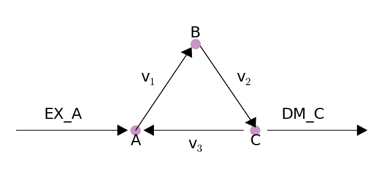

Loopless FBA
============

The goal of this procedure is identification of a thermodynamically
consistent flux state without loops, as implied by the name.

Usually, the model has the following constraints.

.. math::  S \cdot v = 0 

.. math::  lb \le v \le ub 

However, this will allow for thermodynamically infeasible loops
(referred to as type 3 loops) to occur, where flux flows around a cycle
without any net change of metabolites. For most cases, this is not a
major issue, as solutions with these loops can usually be converted to
equivalent solutions without them. However, if a flux state is desired
which does not exhibit any of these loops, loopless FBA can be used. The
formulation used here is modified from `Schellenberger et
al. <http://dx.doi.org/10.1016/j.bpj.2010.12.3707>`__

We can make the model irreversible, so that all reactions will satisfy

.. math::  0 \le lb \le v \le ub \le \max(ub) 

We will add in boolean indicators as well, such that

.. math::  \max(ub) \cdot i \ge v 

.. math::  i \in \{0, 1\} 

We also want to ensure that an entry in the row space of S also exists
with negative values wherever v is nonzero. In this expression,
:math:`1-i` acts as a not to indicate inactivity of a reaction.

.. math::  S^\mathsf T x - (1 - i) (\max(ub) + 1) \le -1 

We will construct an LP integrating both constraints.

.. math::

    \left(
   \begin{matrix}
   S & 0 & 0\\
   -I & \max(ub)I & 0 \\
   0 & (\max(ub) + 1)I & S^\mathsf T
   \end{matrix}
   \right)
   \cdot
   \left(
   \begin{matrix}
   v \\
   i \\
   x
   \end{matrix}
   \right)
   \begin{matrix}
   &=& 0 \\
   &\ge& 0 \\
   &\le& \max(ub)
   \end{matrix}

Note that these extra constraints are not applied to boundary reactions
which bring metabolites in and out of the system.

.. code:: python

    from matplotlib.pylab import *
    %matplotlib inline
    
    import cobra.test
    from cobra import Reaction, Metabolite, Model
    from cobra.flux_analysis.loopless import construct_loopless_model
    from cobra.solvers import get_solver_name

We will demonstrate with a toy model which has a simple loop cycling A
-> B -> C -> A, with A allowed to enter the system and C allowed to
leave. A graphical view of the system is drawn below:

.. code:: python

    figure(figsize=(10.5, 4.5), frameon=False)
    gca().axis("off")
    xlim(0.5, 3.5)
    ylim(0.7, 2.2)
    arrow_params = {"head_length": 0.08, "head_width": 0.1, "ec": "k", "fc": "k"}
    text_params = {"fontsize": 25, "horizontalalignment": "center", "verticalalignment": "center"}
    arrow(0.5, 1, 0.85, 0, **arrow_params)  # EX_A
    arrow(1.5, 1, 0.425, 0.736, **arrow_params)  # v1
    arrow(2.04, 1.82, 0.42, -0.72, **arrow_params)  # v2
    arrow(2.4, 1, -0.75, 0, **arrow_params)  # v3
    arrow(2.6, 1, 0.75, 0, **arrow_params)
    # reaction labels
    text(0.9, 1.15, "EX_A", **text_params)
    text(1.6, 1.5, r"v$_1$", **text_params)
    text(2.4, 1.5, r"v$_2$", **text_params)
    text(2, 0.85, r"v$_3$", **text_params)
    text(2.9, 1.15, "DM_C", **text_params)
    # metabolite labels
    scatter(1.5, 1, s=250, color='#c994c7')
    text(1.5, 0.9, "A", **text_params)
    scatter(2, 1.84, s=250, color='#c994c7')
    text(2, 1.95, "B", **text_params)
    scatter(2.5, 1, s=250, color='#c994c7')
    text(2.5, 0.9, "C", **text_params);

.. code:: python

    test_model = Model()
    test_model.add_metabolites(Metabolite("A"))
    test_model.add_metabolites(Metabolite("B"))
    test_model.add_metabolites(Metabolite("C"))
    EX_A = Reaction("EX_A")
    EX_A.add_metabolites({test_model.metabolites.A: 1})
    DM_C = Reaction("DM_C")
    DM_C.add_metabolites({test_model.metabolites.C: -1})
    v1 = Reaction("v1")
    v1.add_metabolites({test_model.metabolites.A: -1, test_model.metabolites.B: 1})
    v2 = Reaction("v2")
    v2.add_metabolites({test_model.metabolites.B: -1, test_model.metabolites.C: 1})
    v3 = Reaction("v3")
    v3.add_metabolites({test_model.metabolites.C: -1, test_model.metabolites.A: 1})
    DM_C.objective_coefficient = 1
    test_model.add_reactions([EX_A, DM_C, v1, v2, v3])

While this model contains a loop, a flux state exists which has no flux
through reaction v3, and is identified by loopless FBA.

.. code:: python

    construct_loopless_model(test_model).optimize()

.. parsed-literal::

    <Solution 1000.00 at 0x7f003ad82850>

However, if flux is forced through v3, then there is no longer a
feasible loopless solution.

.. code:: python

    v3.lower_bound = 1
    construct_loopless_model(test_model).optimize()

.. parsed-literal::

    <Solution 'infeasible' at 0x7f003ad82f10>

Loopless FBA is also possible on genome scale models, but it requires a
capable MILP solver.

.. code:: python

    salmonella = cobra.test.create_test_model("salmonella")
    construct_loopless_model(salmonella).optimize(solver=get_solver_name(mip=True))

.. parsed-literal::

    <Solution 0.38 at 0x7f003a496190>

.. code:: python

    ecoli = cobra.test.create_test_model("ecoli")
    construct_loopless_model(ecoli).optimize(solver=get_solver_name(mip=True))

.. parsed-literal::

    <Solution 0.98 at 0x7f003ae06b50>

