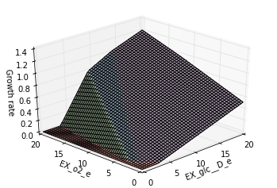

Phenotype Phase Plane
=====================

This example is available as an IPython
`notebook <http://nbviewer.ipython.org/github/opencobra/cobrapy/blob/master/documentation_builder/phenotype_phase_plane.ipynb>`__.

Load iJO1366 as a test model and import cobra

.. code:: python

    from time import time
    
    import cobra
    from cobra.test import ecoli_pickle, create_test_model
    
    from cobra.flux_analysis.phenotype_phase_plane import \
        calculate_phenotype_phase_plane
    
    model = create_test_model(ecoli_pickle)
    model

.. parsed-literal::

    <Model iJO1366 at 0x5b0abd0>

We want to make a phenotype phase plane to evaluate uptakes of Glucose
and Oxygen.

With `matplotlib <http://matplotlib.org>`__ installed, this is as simple
as

.. code:: python

    data = calculate_phenotype_phase_plane(model, "EX_glc_e", "EX_o2_e")
    data.plot_matplotlib();

If `brewer2mpl <https://pypi.python.org/pypi/brewer2mpl/>`__ is
installed, other color schemes can be used as well

.. code:: python

    data.plot_matplotlib("Pastel1")
    data.plot_matplotlib("Dark2");

.. image:: phenotype_phase_plane_files/phenotype_phase_plane_7_0.png

.. image:: phenotype_phase_plane_files/phenotype_phase_plane_7_1.png

The number of points which are plotted in each dimension can also be
changed

.. code:: python

    calculate_phenotype_phase_plane(model, "EX_glc_e", "EX_o2_e",
                                    reaction1_npoints=20,
                                    reaction2_npoints=20).plot_matplotlib();

.. image:: phenotype_phase_plane_files/phenotype_phase_plane_9_0.png

The code can also use multiple processes to speed up calculations

.. code:: python

    start_time = time()
    calculate_phenotype_phase_plane(model, "EX_glc_e", "EX_o2_e", n_processes=1)
    print("took %.2f seconds with 1 process" % (time() - start_time))
    start_time = time()
    calculate_phenotype_phase_plane(model, "EX_glc_e", "EX_o2_e", n_processes=4)
    print("took %.2f seconds with 4 process" % (time() - start_time))

.. parsed-literal::

    took 5.97 seconds with 1 process
    took 2.97 seconds with 4 process

