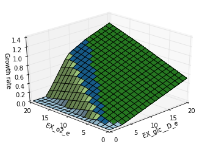

Phenotype Phase Plane
=====================

Phenotype phase planes will show distinct phases of optimal growth with
different use of two different substrates. For more information, see
`Edwards et al. <http://dx.doi.org/10.1002/bit.10047>`__

Cobrapy supports calculating and plotting (using
`matplotlib <http://matplotlib.org>`__) these phenotype phase planes.
Here, we will make one for the "textbook" *E. coli* core model.

.. code:: python

    %matplotlib inline
    from time import time
    
    import cobra.test
    from cobra.flux_analysis import calculate_phenotype_phase_plane
    
    model = cobra.test.create_test_model("textbook")

We want to make a phenotype phase plane to evaluate uptakes of Glucose
and Oxygen.

.. code:: python

    data = calculate_phenotype_phase_plane(model, "EX_glc__D_e", "EX_o2_e")
    data.plot_matplotlib();

If `palettable <https://github.com/jiffyclub/palettable>`__ is
installed, other color schemes can be used as well

.. code:: python

    data.plot_matplotlib("Pastel1")
    data.plot_matplotlib("Dark2");

.. image:: phenotype_phase_plane_files/phenotype_phase_plane_5_0.png

The number of points which are plotted in each dimension can also be
changed

.. code:: python

    calculate_phenotype_phase_plane(model, "EX_glc__D_e", "EX_o2_e",
                                    reaction1_npoints=20,
                                    reaction2_npoints=20).plot_matplotlib();

The code can also use multiple processes to speed up calculations

.. code:: python

    start_time = time()
    calculate_phenotype_phase_plane(model, "EX_glc__D_e", "EX_o2_e", n_processes=1,
                                    reaction1_npoints=100, reaction2_npoints=100)
    print("took %.2f seconds with 1 process" % (time() - start_time))
    start_time = time()
    calculate_phenotype_phase_plane(model, "EX_glc__D_e", "EX_o2_e", n_processes=4,
                                    reaction1_npoints=100, reaction2_npoints=100)
    print("took %.2f seconds with 4 process" % (time() - start_time))

.. parsed-literal::

    took 0.41 seconds with 1 process
    took 0.29 seconds with 4 process

