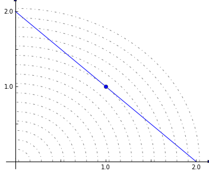
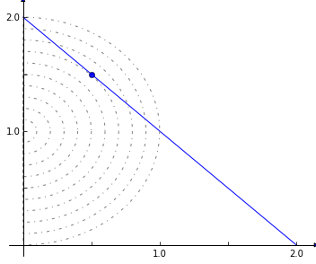

Quadratic Programming
=====================

Suppose we want to minimize the Euclidean distance of the solution to
the origin while subject to linear constraints. This will require a
quadratic objective function. Consider this example problem:

    **min** :math:`\frac{1}{2}\left(x^2 + y^2 \right)`

    *subject to*

    :math:`x + y = 2`

    :math:`x \ge 0`

    :math:`y \ge 0`

This problem can be visualized graphically:

.. code:: python

    %matplotlib inline
    from matplotlib.pyplot import figure, xlim, ylim
    from mpl_toolkits.axes_grid.axislines import SubplotZero
    from numpy import linspace, arange, sqrt, pi, sin, cos, sign
    # axis style
    def make_plot_ax():
        fig = figure(figsize=(6, 5));
        ax = SubplotZero(fig, 111); fig.add_subplot(ax)
        for direction in ["xzero", "yzero"]:
            ax.axis[direction].set_axisline_style("-|>")
            ax.axis[direction].set_visible(True)
        for direction in ["left", "right", "bottom", "top"]:
            ax.axis[direction].set_visible(False)
        xlim(-0.1, 2.1); ylim(xlim())
        ticks = [0.5 * i for i in range(1, 5)]
        labels = [str(i) if i == int(i) else "" for i in ticks]
        ax.set_xticks(ticks); ax.set_yticks(ticks)
        ax.set_xticklabels(labels); ax.set_yticklabels(labels)
        ax.axis["yzero"].set_axis_direction("left")
        return ax
        
    ax = make_plot_ax()
    ax.plot((0, 2), (2, 0), 'b')
    ax.plot([1], [1], 'bo')
    
    # circular grid
    for r in sqrt(2.) + 0.125 * arange(-11, 6):
        t = linspace(0., pi/2., 100)
        ax.plot(r * cos(t), r * sin(t), '-.', color="gray")

The objective can be rewritten as
:math:`\frac{1}{2} v^T \cdot \mathbf Q \cdot v`, where
:math:`v = \left(\begin{matrix} x \\ y\end{matrix} \right)` and
:math:`\mathbf Q = \left(\begin{matrix} 1 & 0\\ 0 & 1 \end{matrix}\right)`

The matrix :math:`\mathbf Q` can be passed into a cobra model as the
quadratic objective.

.. code:: python

    import scipy
    
    from cobra import Reaction, Metabolite, Model, solvers

The quadratic objective :math:`\mathbf Q` should be formatted as a scipy
sparse matrix.

.. code:: python

    Q = scipy.sparse.eye(2).todok()
    Q

.. parsed-literal::

    <2x2 sparse matrix of type '<type 'numpy.float64'>'
    	with 2 stored elements in Dictionary Of Keys format>

In this case, the quadratic objective is simply the identity matrix

.. code:: python

    Q.todense()

.. parsed-literal::

    matrix([[ 1.,  0.],
            [ 0.,  1.]])

We need to use a solver that supports quadratic programming, such as
gurobi or cplex. If a solver which supports quadratic programming is
installed, this function will return its name.

.. code:: python

    print(solvers.get_solver_name(qp=True))

.. parsed-literal::

    gurobi

.. code:: python

    c = Metabolite("c")
    c._bound = 2
    x = Reaction("x")
    y = Reaction("y")
    x.add_metabolites({c: 1})
    y.add_metabolites({c: 1})
    m = Model()
    m.add_reactions([x, y])
    sol = m.optimize(quadratic_component=Q, objective_sense="minimize")
    sol.x_dict

.. parsed-literal::

    {'x': 1.0, 'y': 1.0}

Suppose we change the problem to have a mixed linear and quadratic
objective.

    **min** :math:`\frac{1}{2}\left(x^2 + y^2 \right) - y`

    *subject to*

    :math:`x + y = 2`

    :math:`x \ge 0`

    :math:`y \ge 0`

Graphically, this would be

.. code:: python

    ax = make_plot_ax()
    ax.plot((0, 2), (2, 0), 'b')
    ax.plot([0.5], [1.5], 'bo')
    
    yrange = linspace(1, 2, 11)
    for r in (yrange ** 2 / 2. - yrange):
        t = linspace(-sqrt(2 * r + 1) + 0.000001, sqrt(2 * r + 1) - 0.000001, 1000)
        ax.plot(abs(t), 1 + sqrt(2 * r + 1 - t ** 2) * sign(t), '-.', color="gray")

QP solvers in cobrapy will combine linear and quadratic coefficients.
The linear portion will be obtained from the same objective\_coefficient
attribute used with LP's.

.. code:: python

    y.objective_coefficient = -1
    sol = m.optimize(quadratic_component=Q, objective_sense="minimize")
    sol.x_dict

.. parsed-literal::

    {'x': 0.5, 'y': 1.5}

